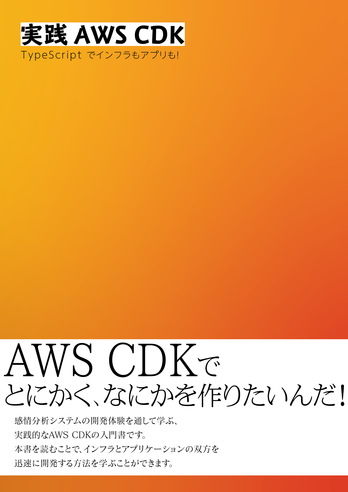
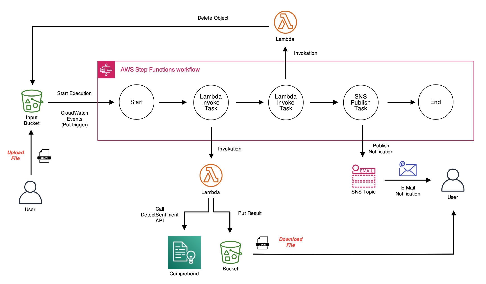

# README

同人誌サークル [Silverworks](https://twitter.com/SilverworksClub) による同人誌
「[実践AWS CDK - TypeScript でインフラもアプリも！](https://silverworks-techbookfest.tumblr.com/)」のサンプルコードです。

<!--  -->
</img>

## 概要

書籍内で登場する感情分析システム「Osenchi」のソースコードです。

S3 を入出力として、Comprehend による感情分析処理の結果を返します。

## 使い方

### 前提

- AWSアカウント
- Node.js (>=10.16.3)
- AWS CDK (>=1.25)

(To be written)

## 出展

- [技術書典8](https://techbookfest.org/event/tbf08)
- [技術書典 応援祭](https://techbookfest.org/)

## 追記

(2021.04.14) 依存関係の陳腐化により、 Linter の結果が正しくなくなってしまう不具合を下記の記事でご指摘いただきました。ご指摘ありとうございます。

https://note.com/dafujii/n/n35f964b1bd70
